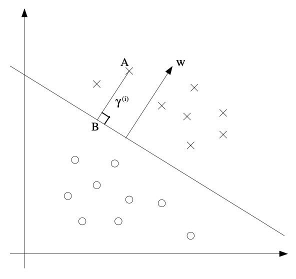

# Media Resolution Test

## Question 1
This question references a nested audio file that should be found by centralized media access.

Audio from nested location: [Nested Audio](nested-audio.mp3)

## Question 2  
This references media from the root directory (existing functionality).

Audio from root: [Root Audio](audio1_1.mp3)

## Question 3
Mixed media test with image from root and audio from nested location.

Audio: [Nested Audio](nested-audio.mp3)
